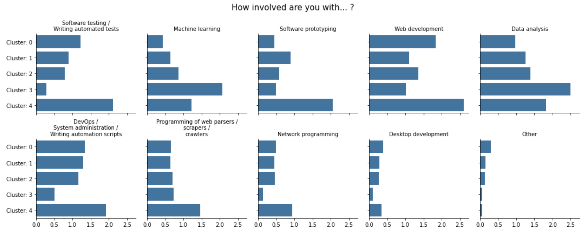
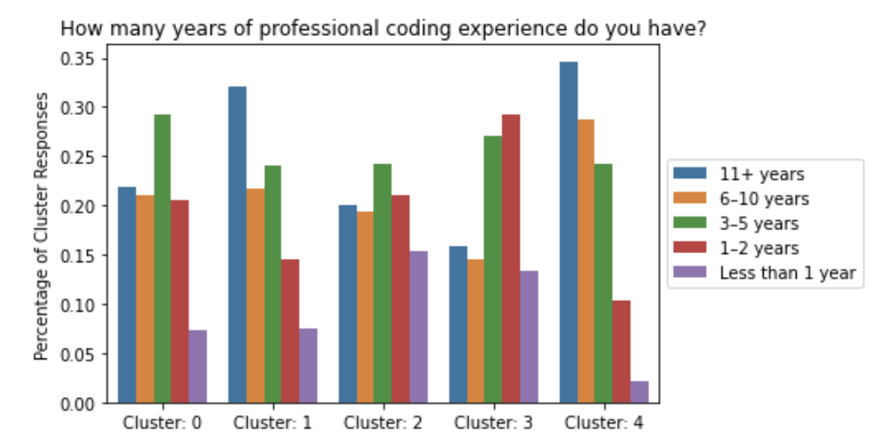
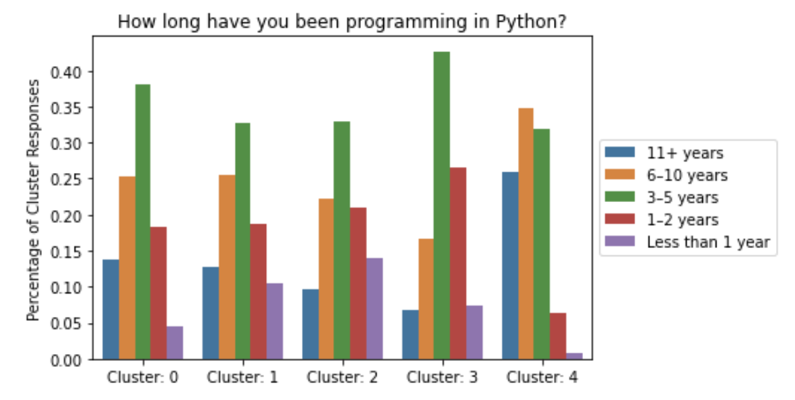
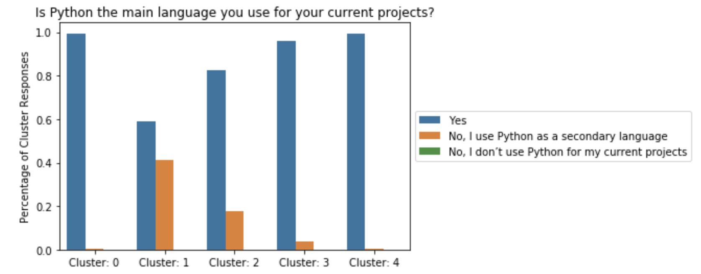
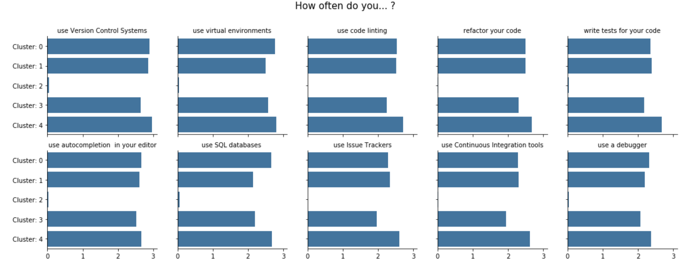

# Python Dev Survey Analysis

Analysis of [Python Developers Survey 2019 Results](https://www.jetbrains.com/lp/python-developers-survey-2019/?utm_source=marketo&utm_medium=email&utm_campaign=pycharm&utm_content=newsletter&mkt_tok=eyJpIjoiTkRjM1lqUm1ZalUxTmpVNSIsInQiOiJOQVQrOHlTV1dtekREaHljMlhXcWZQeGc5Y2RHVk55QTRCam9LRVJWdkJkRVwvYk5hdm0yZTdxbEgzaVdaVk0rNzlHbnVORDVSR2xCRW5pQ1F0Z0lJRE9XTnFJcDFjVFA1TzJ4ZlJzQzJIVlJPNnpRYVRBTGpnNHdXWFZuYXJJcnoifQ%3D%3D) collected by JetBrains.

Raw data can be found here: [https://drive.google.com/drive/folders/1GW86M_QLFOA2KyeWeb8hzBj_RqQIXmAU?usp=sharing](https://drive.google.com/drive/folders/1GW86M_QLFOA2KyeWeb8hzBj_RqQIXmAU?usp=sharing)

Project was performed as a demo and this restricted the work to a < 1 week timeline.

## Results of Cluster Analysis

Questions were analyzed in 3 groups: (1) how involved are you with, (2) general, & (3) how often do you.

#### How could analysis be used?

If these clusters were to be used to segment PyCharm customers.  The main groups might be:

* Less experienced programmers, interested in more Data Science focused features (Cluster 3)
* More experienced programmers, interested in more traditional Software Engineering features (Clusters 1 & 4)

Analyzing / polling these groups might lead to valuable market analysis of these segments.

#### Cluster differences on 'how involved are you with' questions

 

Cluster 4 (the cluster with the most professional coding experience) dominates most of these categories. The exception is in 'Machine Learning' and 'Data Analysis' where Cluster 3 (the least experienced cluster) marked the highest involvement. Cluster 3 appears to be newer to programming and more involved in 'Data Science' tasks.  Is this explained by being new to the field in general or because their more focused on the math/stats side of these tasks?

#### Cluster differences on general questions

 

   
Order of average coding experience: 4, 1, 0, 2, 3

 

Order of average Python experience: 4, 0, 1, 2, 3

Everyone's average experience stayed fairly similiar to their response to the general coding experience question. The exception to this is Cluster 1 who had the biggest drop in experience. Cluster 1 is also the cluster who reported they don't use Python as their main language.

 

#### Cluster differences on 'how often do you' questions

 

This explains why Cluster 2 exists. Cluster 2 was by far the least likely to mark that they did any of these activities 🤦.  This might indicate they skipped this section rather than them actually not doing these activities.

Cluster 4 (most experienced programmers) does all of these activities the most. Cluster 0 is right behind.  Cluster 3 (less experienced programmers) does most of these activities the least (excluding Cluster 2).

#### Final Cluster Summary Statements

##### Cluster 1

Python is not their first choice for programming.  They are experienced programmers, and they use varying technologies and techniques

##### Cluster 2

Might not be a cluster of interest.  Membership seems mostly based on not answering the "How often do you... ?" series of questions.

##### Cluster 3

Less experienced programmers with a focus on data science style tasks.  Is their lack of programming experience due to a lack of experience in industry or due to a heavier focus on the math/stats of data science tasks?

##### Cluster 4

Most experienced Programmers and most experienced Pythonistas.  They are more classical programmers than they are data scientists.

##### Cluster 0

Appears to be more of a 'catch-all' cluster for the remaining participants.  Future work might include a more granular cluster analysis.

#### Limitations

* This analysis ignored many of the survey participants and many of the questions.
    * These decisions were made due to a short project timeline.
* Treating a lack of response as an indication of not using a technology / technique should be revisited.
* There is survey data available for 2017, 2018, & 2019.  Only 2019 was considered.  Could previous results be leveraged in analysis?

#### How could analysis be used?

If these clusters were to be used to segment PyCharm customers.  The main groups might be:

* Less experienced programmers, interested in more Data Science focused features (Cluster 3)
* More experienced programmers, interested in more traditional Software Engineering features (Clusters 1 & 4)

Analyzing / polling these groups might lead to valuable market analysis of these segments.
